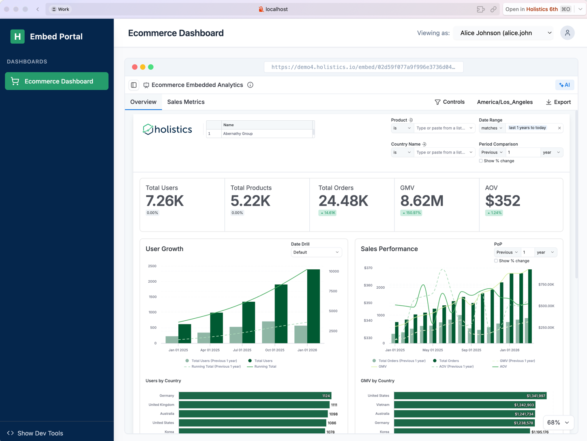

# Brainstorm APAC Embed POC

A focused adaptation of the Holistics Embed Portal template for testing company-level row-level security on the Brainstorm APAC dashboard.

The browser selects one of two synthetic non-admin identities. The backend maps that identity to an approved numeric company ID and distinct embedded organization, signs a short-lived JWT, and returns the Embed Portal URL. The browser cannot submit an arbitrary company ID.



## Tech Stack

- **Frontend**: React, Vite, Tailwind CSS
- **Backend**: Node.js, Express, `jsonwebtoken`
- **Deployment**: Cloudflare Pages + Pages Functions

## Project Structure

```
├── backend/
│   └── server.js            # Express API server (local dev)
├── frontend/
│   ├── functions/api/        # Cloudflare Pages Functions (production)
│   ├── src/                  # React app source
│   ├── public/               # Static assets
│   ├── index.html
│   ├── vite.config.js
│   ├── tailwind.config.js
│   ├── postcss.config.js
│   └── eslint.config.js
├── functions/                # Cloudflare Pages Functions (deploy copy)
└── package.json
```

## Getting Started

### 1. Install dependencies

```bash
npm install
```

### 2. Configure environment variables

The app requires these runtime variables:

```text
HOLISTICS_EMBED_KEY
HOLISTICS_EMBED_SECRET
BRAINSTORM_COMPANY_A_ID
BRAINSTORM_COMPANY_B_ID
```

The company IDs must be different positive integers from the deployed Brainstorm seed data. Keep the embed key and signing secret out of Git.

For local use, store only 1Password references in `.env`, then resolve them at process start:

```bash
op run --env-file .env -- npm run server
```

### 3. Start the backend server

If you did not start it through `op run` above:

```bash
npm run server
# → http://localhost:3001
```

### 4. Start the frontend (in a separate terminal)

```bash
npm run dev
# → https://localhost:5173
```

Open <https://localhost:5173> in your browser. Accept the self-signed certificate warning.

Switch between the two synthetic identities in the header. Each generated token contains one numeric user attribute:

```text
user_attributes.company_id = [<seeded numeric company ID>]
```

All Brainstorm datasets must independently map their numeric `company_id` field to this user attribute before the embed can be treated as an RLS proof.

The deployed AML object must be an Embed Portal named `brainstorm_apac_embed_portal` containing the Brainstorm dashboard. Each test identity receives a distinct `embed_user_id` and `embed_org_id`; neither identity has admin access.

## Deployment (Cloudflare Pages)

The template can be deployed to Cloudflare Pages with serverless functions handling the API.

### Deploy manually

```bash
# Build the frontend
npm run build

# Copy functions to root (Cloudflare expects functions/ as sibling to output dir)
cp -r frontend/functions functions

# Deploy
CLOUDFLARE_ACCOUNT_ID=<your_account_id> wrangler pages deploy dist \
  --project-name holistics-embed-demo \
  --branch main \
  --commit-dirty=true
```

Configure all four runtime variables in the deployment environment. Do not commit their values or a populated environment file.
